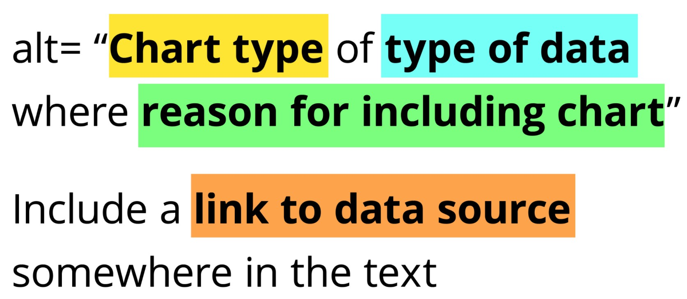
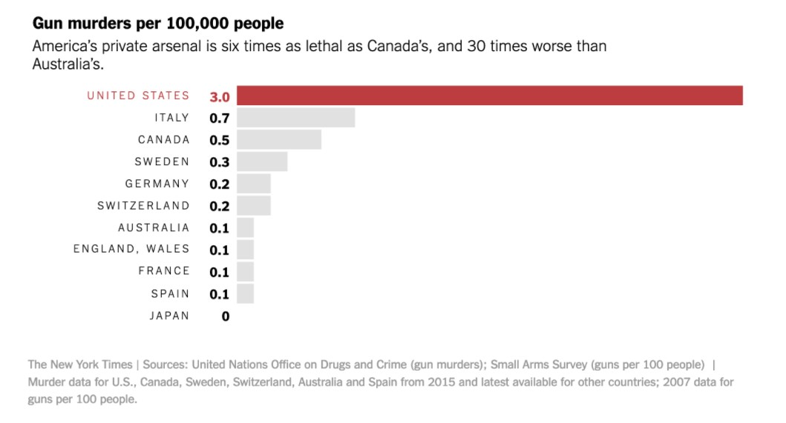
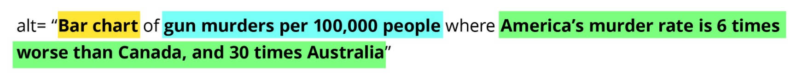
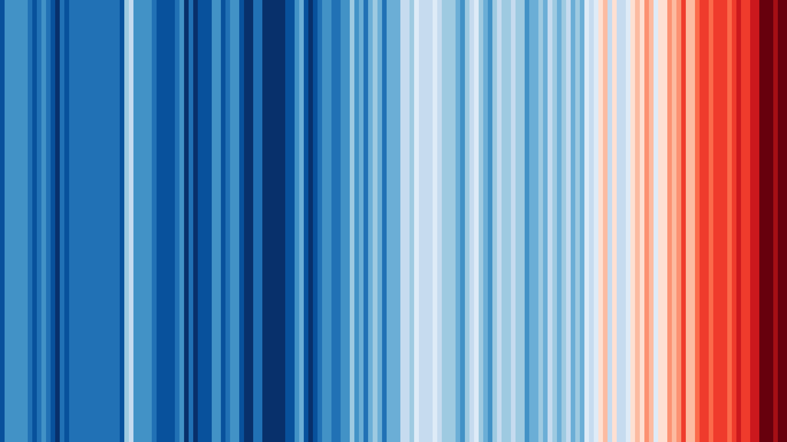
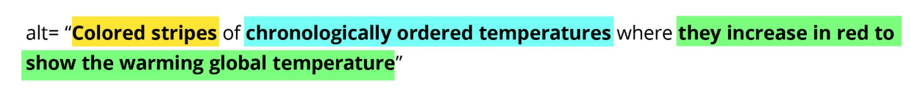

<body>
  <article>

```{r include=FALSE}
knitr::opts_chunk$set(echo = TRUE)
library(ggplot2)
```

To see the accessibility check for this webpage, please visit [WAVE](https://wave.webaim.org/report#/https://datasciencecampus.github.io/DSCA_WCAG-2.1-Compliance/).

## BLUF

* Specify `lang: "en"` in the YAML.
* See [alt text guidance](#alt-guide).  
* {Brailler} can automate descriptive chart alt text for **some** base and ggplots.  
* Use chunk option `comment=""` to remove hashes preceding code output.
* Markdown image syntax is inconsistent for alt text. Suggest avoiding in favour of html img tags, defining the alt attribute.
* Ideal solution for chart alt text: write the chart to `tempfile()` and read in using html img tag, specifying alt text atttribute.
* Next best solution for chart alt text: Use `fig.cap` not `fig.alt` chunk option and tolerate duplicate text warning as suggested in [literature](#res).  


***
***

## Plot Alt Text

You can also embed plots, for example:

```{r plot, echo=TRUE, fig.alt="Some placeholder alt text for a chart"}
plot(pressure)
```

The above uses the `fig.alt` option on a base R plot. This causes an issue on WAVE as the image title attribute is set to the same value as the alt text.

***

```{r plot2, echo=TRUE, fig.alt="Some different alt text for a chart"}

ggplot(data = pressure, aes(temperature, pressure)) +
  geom_point() +
  labs(title  = "Some placeholder title")
```

Again, using `fig.alt` option above but this time specifying a chart title using {ggplot2} syntax does not resolve the issue with title and alt attributes having the same value. 

***

```{r plot3, echo=TRUE, fig.cap="Using fig.cap instead"}

ggplot(data = pressure, aes(temperature, pressure)) +
  geom_point() +
  labs(title  = "Some placeholder title")
```

Using the `fig.cap` chunk option avoids the issue with redundant title warning that comes with `fig.alt`. This provides a redundant text warning which I feel is more helpful than the redundant title warning for VI learners. Note that specifying the YAML option `fig_caption: false` does not resolve this issue, instead raising the redundant title warning again. This means [screen reader users will hear the text twice](https://r-resources.massey.ac.nz/rmarkdown/)

***

As advised by contractor on 2021 accessibility audit: Include blank alt text followed by the alt text in HTML p tag.

```{r blankalt, echo=TRUE, fig.cap=""}

ggplot(data = pressure, aes(temperature, pressure)) +
  geom_point() +
  labs(title  = "Some placeholder title")
```
<p>Using p tags for alt text.</p>


***

Suggest using writing out chart to img, reading back in with alt text defined as per usual images.

```{r write_img}
tmp <- tempfile(fileext = ".png")
ggsave(tmp, device = png())

```


The above method results in `alt = ""`, that should only be used when the image is strictly decorative. The below image uses img html tags instead.


***

### Using `access_img()`

```{r, access_img}
# load in function
source("../R/access_img.R")
access_img()
```


```{r, stop}

stop("here")

```


***

[Joo Young Seo](#res) suggests the use of {BrailleR} (among others) for improving VI access of data & charts. Not published to CRAN at time of writing. Maintainer appears to be working on CRAN submission.

```{r, echo=TRUE}
# devtools::install_github("ajrgodfrey/BrailleR")
library(BrailleR)
```

```{r plot4, echo=TRUE, comment=""}

VI(ggplot(data = pressure, aes(temperature, pressure)) +
  geom_point() +
  labs(title  = "Some placeholder title"))
```

***

### Alt Text Structure {#alt-guide}

This section is mostly from Cesal, 2020 (see [Resources](#res)).


***

So for the following New york Times chart:


Alt text as below is suggested:


***

Or for a more complex chart, such as [Warming Stripes, Hawkins](#res):



Alt text suggested:



***
***

## Code Output

```{r}
# some unadjusted code with no chunk options
1:100
```

```{r, comment=""}
# adjusted chunk options: `comment=""`, as recommended in Yihui see resources section.
1:100
```
Counterintuitively, the chunk option `comment=""` affects the chunk output rather than the appearance of code comments.

***
***

## Resources {#res}

[Yihui, Rmarkdown cookbook](https://bookdown.org/yihui/rmarkdown-cookbook/html-accessibility.html)

[A. Jonathan R. Godfrey, 2018](https://r-resources.massey.ac.nz/rmarkdown/)

[Joo Young Seo, 2020](https://jooyoungseo.com/post/ds4blind/)

[Mock, 2021](https://themockup.blog/posts/2021-04-01-three-years-of-tidytuesday/#alt-text-for-graphs)

[Cesal, 2020](https://medium.com/nightingale/writing-alt-text-for-data-visualization-2a218ef43f81)

[Canelon & Hare, 2021](https://silvia.rbind.io/talk/2021-05-04-data-viz-accessibility/)

[Hawkins, Show Your Stripes](https://showyourstripes.info/)

***
***

## To do

* Apply joint branding template.
* webpage regions - need greater control over YAML header / supplement with inline html  
* Try Thom Mock's alt text for charts implementation. Does this neatly fix the duplicate title / text issue.  
* styling of chunk outputs
* header hierarchy - css to adjust author & date header titles
* header hierarchy - css to modify default appearance of h2s etc

  </article>
</body>
